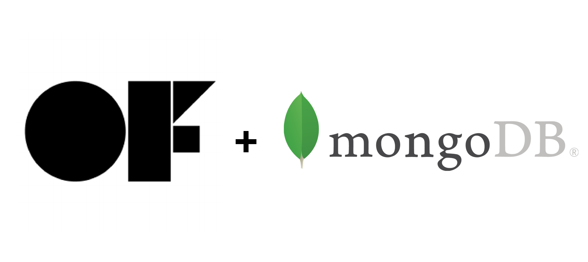

# Introduction

ofxMongo is an OpenFrameworks addons that allows you to connect with mongoDB server



This is a work in progress project, actually the addons allows you to connect to the mongoDB and insert the records.
I will porting others function soon.
Tested on OSX 10.13 and Linux Debian/Ubuntu
created by [Roberto Fazio Studio 2018](https://studiorf.io)

# Including ofxMongo

Create a new project with PG (Project Generator), and open the project file in your IDE.

Inside your ofApp.h you will need to include:

```shell
#include "ofxMongo.h"
```
Declare the mongoclient object
```shell
ofxMongo mongoclient;
```

Inside your ofApp.cpp

```shell
void ofApp::setup()
{
    mongoclient.hello_mongo();
}
```

mongoclient.insert

```shell
void ofApp::keyPressed(int key)
{
    if(key == '1')
    {
        int rnd = ofRandom(0.0f, 1000.0f);
        mongoclient.insert("myRandomField", ofToString(rnd));
    }
}
```

# Installing MongoDB Community Edition

Just follow the official MongoDB instruction

[MongoDB installation](https://docs.mongodb.com/manual/installation/)

# Installing MongoDB Compass

In addiction, if you want a GUI for MongoDB install MongoDB Compass for Mac, Linux, Win

[MongoDB Compass](https://www.mongodb.com/products/compass)

# Installation 

You have to install mongo-c and mongo-cxx 

## ** Linux **

## Prerequisites

**mongo driver installation**

### Install mongo-c

http://mongoc.org/libmongoc/current/installing.html
version: 1.12.0
built on Debian 4.9.110-1

according to "Build from tarball" instructions:
```shell
$ wget https://github.com/mongodb/mongo-c-driver/releases/download/1.12.0/mongo-c-driver-1.12.0.tar.gz
$ tar xzf mongo-c-driver-1.12.0.tar.gz
$ cd mongo-c-driver-1.12.0
$ mkdir cmake-build
$ cd cmake-build
```
build command for static libraries:
```shell
$ cmake -DENABLE_AUTOMATIC_INIT_AND_CLEANUP=OFF -DCMAKE_BUILD_TYPE=Release -DENABLE_STATIC=ON ..
$ make
$ sudo make install
```
### Install mongocxx

https://mongodb.github.io/mongo-cxx-driver/mongocxx-v3/installation/

version: 3.2.x
built on Debian 4.9.110-1

according to instructions:
```shell
$ git clone https://github.com/mongodb/mongo-cxx-driver.git \
--branch releases/stable --depth 1
$ cd mongo-cxx-driver/build
```
build command for static libraries:
```shell
$ cmake -DCMAKE_BUILD_TYPE=Release -DCMAKE_INSTALL_PREFIX=/usr/local -DBUILD_SHARED_LIBS=OFF ..
$ sudo make EP_mnmlstc_core
$ make
$ sudo make install
```

/usr/local/include/* headers and /usr/local/lib/* static libraries are linked through the ADDON_PKG_CONFIG_LIBRARIES directive (addon_config.mk)

## ** OSX 10.13 **

## Prerequisites

### Build Cyrus
https://cyrusimap.org/sasl/sasl/installation.html#quick-install-guide
in my case I installed cyrus-sasl-2.1.27-rc8
ftp://ftp.cyrusimap.org/cyrus-sasl/cyrus-sasl-2.1.27-rc8.tar.gz

```shell
cd (directory it was untarred into)
./configure
make
sudo make install
```

### XCODE 9 Project

Use projectGenerator adding ofxMongo.

Add Cyrus SASL framework to XCODE project:
General>Linked Frameworks and Libraries
add libsasl2.tbd

Add resolv
General>Linked Frameworks and Libraries
add libresolv.9.tbd

You should already see headers included in Build Settings>Header Search Paths as
../../../addons/ofxMongo/src
../../../addons/ofxMongo/include

**mongo driver installation**

The headers included in this addon were copied from:

/usr/local/include/bsoncxx/v_noabi/bsoncxx

/usr/local/include/mongocxx/v_noabi/mongocxx

/usr/local/include/libbson-1.0

/usr/local/include/libmongoc-1.0

and

/usr/local/opt/openssl/include/openssl

The static libraries included in this addon were copied from:

/usr/local/lib/

and

/usr/local/opt/openssl/lib/libcrypto.a
/usr/local/opt/openssl/lib/libssl.a

If you need/want to build your own libraries, follow steps below then copy the files from OS into the addon.

### Install mongo-c

http://mongoc.org/libmongoc/current/installing.html

version: 1.12.0

according to "Building on Mac OS X" instructions,
install XCode CLI
```shell
$ xcode-select --install
```
install Homebrew

https://brew.sh/

install cmake:
```shell
$ brew install cmake
```

Download and build:
```shell
$ curl -LO https://github.com/mongodb/mongo-c-driver/releases/download/1.12.0/mongo-c-driver-1.12.0.tar.gz
$ tar xzf mongo-c-driver-1.12.0.tar.gz
$ cd mongo-c-driver-1.12.0
$ mkdir cmake-build
$ cd cmake-build
```
build command for static libraries:
```shell
$ cmake -DENABLE_AUTOMATIC_INIT_AND_CLEANUP=OFF -DCMAKE_BUILD_TYPE=Release -DENABLE_STATIC=ON ..
$ make
$ sudo make install
```
### Install mongocxx

https://mongodb.github.io/mongo-cxx-driver/mongocxx-v3/installation/

version: 3.2.x

according to instructions:
```shell
$ git clone https://github.com/mongodb/mongo-cxx-driver.git \
--branch releases/stable --depth 1
$ cd mongo-cxx-driver/build
```
build command for static libraries:
```shell
$ cmake -DCMAKE_BUILD_TYPE=Release -DCMAKE_INSTALL_PREFIX=/usr/local -DBUILD_SHARED_LIBS=OFF ..
$ sudo make EP_mnmlstc_core
$ make
$ sudo make install
```

### XCode Project Configuration 

You have to link the static library


